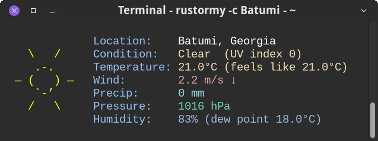

# rustormy

Minimal and neofetch-like weather CLI inspired by
[stormy](https://github.com/ashish0kumar/stormy) and
[rainy](https://github.com/liveslol/rainy), written in 🦀 Rust

[](https://github.com/Tairesh/rustormy/actions/workflows/tests.yml)
[](https://crates.io/crates/rustormy)
[](https://github.com/Tairesh/rustormy/commits/main)
[](https://github.com/Tairesh/rustormy/tree/main)



---

## Current features

- Fetch weather data from [OpenMeteo](https://open-meteo.com/) (no API key required)
  or [OpenWeatherMap](https://openweathermap.org/)
- Display current temperature, weather condition, wind speed and direction, humidity. precipitation, atmospheric
  pressure.
- Display ASCII art icons for weather conditions
- ANSI colors in terminal output
- Supports city name or latitude/longitude input
- Supports multiple languages (English, Russian, Spanish; more to come)
- Supports imperial and metric units
- Supports JSON output
- Live mode (periodically fetch and display updated weather data)

## Planned features

- Support for more weather APIs
- More detailed weather information (e.g. dew point, UV index, etc.)
- More customization options (e.g. colors, layout, etc.)

## Installation

You can install `rustormy` using `cargo`:

```sh
cargo install rustormy
```

Or download a precompiled binary from the [releases page](https://github.com/Tairesh/rustormy/releases).

## Configuration

`rustormy` uses XDG Base Directory Specification for configuration files and will create a configuration file at
`~/.config/rustormy/config.toml` to set default options at first run.

On macOS, the configuration file will be located at
`$HOME/Library/Application Support/rustormy/config.toml`.

On Windows, the configuration file will be located at
`%APPDATA%\Roaming\rustormy\config.toml`.

### Configuration options

```toml
# Default city name (if not provided via CLI)
city = "New York"
# Default latitude (if not provided via CLI)
lat = 40.7128
# Default longitude (if not provided via CLI)
lon = -74.0060
# Weather data provider (`open_meteo` or `open_weather_map`)
provider = "open_meteo"
# API key for OpenWeatherMap (required if provider is `open_weather_map`)
api_key = ""
# Default units for temperature and wind speed (`metric` or `imperial`)
units = "metric"
# Default output format (`text` or `json`)
output_format = "text"
# Language for weather description (e.g. "en" for English, "ru" for Russian, "es" for Spanish, etc.)
language = "en"
# Show city name in output
show_city_name = true
# Use ANSI colors in terminal output
use_colors = true
# Use exact degrees for wind direction instead of arrows
use_degrees_for_wind = true
# Compact mode (text output without trailing newlines and labels, but still with icon)
compact_mode = true
# Live mode (periodically fetch and display updated weather data)
live_mode = false
# Live mode interval in seconds
live_mode_interval = 300
```

## Usage

```
rustormy [OPTIONS]

Options:
  -c, --city <CITY>
          City name (required if lat/lon not provided)
  -y, --lat <LAT>
          Latitude (required if city not provided)
  -x, --lon <LON>
          Longitude (required if city not provided)
  -p, --provider <PROVIDER>
          Weather data provider [possible values: open_meteo, open_weather_map]
  -u, --units <UNITS>
          Units for temperature and wind speed [possible values: metric, imperial]
  -o, --format <OUTPUT_FORMAT>
          Output format [possible values: text, json]
  -g, --lang <LANGUAGE>
          Language for weather output [possible values: en, ru, es]
      --name
          Show city name in output
      --colors
          Use colors in output
      --degrees
          Use degrees for wind direction in output
      --compact
          Compact mode for text output
  -l, --live
          Live mode - continuously update weather data every 5 minutes (or specified interval)
  -i, --interval <LIVE_MODE_INTERVAL>
          Live mode update interval in seconds (default: 300)
  -h, --help
          Print help
  -V, --version
          Print version

```

## Examples


## License

This project is licensed under the MIT License. See the [LICENSE](LICENSE) file for details.

## Contributing

Contributions are welcome! Please open an issue or submit a pull request on GitHub.
