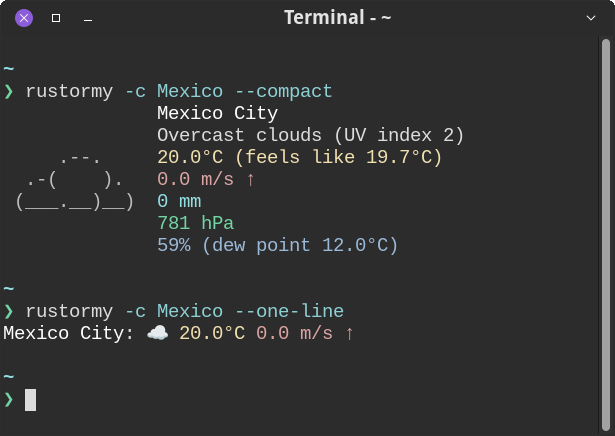

# rustormy

Minimal and neofetch-like weather CLI with multiple data providers support, ASCI-icons, ANSI colors, localization and
various output modes.

[](https://github.com/Tairesh/rustormy/actions/workflows/tests.yml)
[](https://crates.io/crates/rustormy)
[](https://github.com/Tairesh/rustormy/commits/main)
[](https://github.com/Tairesh/rustormy/tree/main)


---

## Current features

- Fetch weather data from multiple providers:
    - [OpenMeteo](https://open-meteo.com/) (default, no API key required)
    - [Yr.no](https://www.yr.no/) (no API key required)
    - [OpenWeatherMap](https://openweathermap.org/)
    - [World Weather Online](https://www.worldweatheronline.com/)
    - [WeatherAPI.com](https://www.weatherapi.com/)
    - [Weatherbit.io](https://www.weatherbit.io/)
    - [Tomorrow.io](https://www.tomorrow.io/weather-api/)
    - [OpenUV](https://www.openuv.io/) (for UV index data, can be used alongside any main weather provider)
- Automatically fall back to the next provider if the primary one is unavailable (e.g., due to API limits)
- Display current temperature, "feels like" temperature, weather conditions, wind speed and direction
  humidity, precipitation, atmospheric pressure, dew point, and UV index (if supported by the provider)
- Render ASCII art icons for weather conditions
- Support ANSI colors in terminal output
- Provide geocoding by city name or latitude/longitude input
- Cache geocoding results to reduce API calls (optional)
- Support multiple languages (English, Russian, Spanish; more to come)
- Support automatic conversion between imperial and metric units
- Provide various text output modes (full, compact, one-line) and JSON output
- Support live mode for periodically updating weather data
- Cross-platform (Linux, macOS, Windows)

## Planned features

- More weather-related information (e.g. sunrise/sunset times, moon phase, etc.)
- More ASCII art icons for different weather conditions (also different for day and night)
- More weather data providers
- More customization options (e.g. colors, layout, etc.)
- More languages
- Improved test coverage
- Homebrew, nix, rpm, deb packages
- Docker image (just for fun)

## Installation

You can install `rustormy` using `cargo`:

```sh
cargo install rustormy
```

Or download a precompiled binary from the [releases page](https://github.com/Tairesh/rustormy/releases).

## Configuration

`rustormy` can be configured using a configuration file in TOML format.
It will be created automatically on first run if it does not exist.
To select a location of this file, `rustormy` uses the standard platform-specific directories:

On Linux, it uses
the [XDG base directory](https://standards.freedesktop.org/basedir-spec/basedir-spec-latest.html)
and the [XDG user directory](https://www.freedesktop.org/wiki/Software/xdg-user-dirs/) specifications.
By default, the configuration file will be located at `~/.config/rustormy/config.toml`.

On macOS, it uses
the [Standard Directories](https://developer.apple.com/library/content/documentation/FileManagement/Conceptual/FileSystemProgrammingGuide/FileSystemOverview/FileSystemOverview.html#//apple_ref/doc/uid/TP40010672-CH2-SW6).
The configuration file will be located at `$HOME/Library/Application Support/rustormy/config.toml`.

On Windows, it uses
the [Known Folder](https://msdn.microsoft.com/en-us/library/windows/desktop/bb776911(v=vs.85).aspx) system.
The configuration file will be located at `%APPDATA%\rustormy\config\config.toml`.

### Configuration file options

#### Providers

Default provider is `open_meteo`.

```toml
providers = ["open_meteo"]
```

Possible values: `open_meteo`, `open_weather_map`, `world_weather_online`, `weather_api`, `weather_bit`, `tomorrow_io`,
`yr`.
You can also use short names: `om`, `owm`, `wwo`, `wa`, `wb`, `ti`, `yr`, respectively.
Note that all providers except `open_meteo` and `yr` require an API key.
You can specify multiple providers in the `providers` array to try them in order.

Example:

```toml
providers = ["tomorrow_io", "weather_api", "world_weather_online", "open_weather_map", "weather_bit", "yr", "open_meteo"]
```

---

#### Location

You can specify location either by `city` name or by `lat` and `lon` coordinates.
If both are provided, coordinates will be used.
You can skip this section to provide location via command line options.

Example:

```toml
city = "London"
lat = 51.5074
lon = -0.1278
```

---

#### Live mode

Live mode can be enabled with `live_mode = true` to update weather data every `live_mode_interval` seconds
(default is 300 seconds, i.e., 5 minutes)

```toml
live_mode = false
live_mode_interval = 300
```

---

#### Geocoding cache

Geocoding cache can be enabled with `use_geocoding_cache = true` to cache
previously looked up cities locally to avoid repeated API calls.
Note that this cache is only for geocoding (getting coordinates from city names), not for weather data.
Also, World Weather Online and WeatherAPI.com providers do not require geocoding, so caching is not needed for them.

```toml
use_geocoding_cache = false
```

---

#### Verbosity level

Verbosity level can be set with `verbose` option (0 - no verbose, 1 - show errors)

```toml
verbose = 0
```

---

#### Connect timeout

API HTTP client timeout in seconds (default is 10 seconds)

```toml
connect_timeout = 10
```

---

#### API keys

Some weather data providers require an API key to access their services.
You can obtain free API keys by signing up on their websites:

- [OpenWeatherMap](https://home.openweathermap.org/users/sign_up)
- [World Weather Online](https://www.worldweatheronline.com/developer/)
- [WeatherAPI.com](https://www.weatherapi.com/signup.aspx)
- [Weatherbit.io](https://www.weatherbit.io/account/create)
- [Tomorrow.io](https://www.tomorrow.io/weather-api/)
- [OpenUV](https://www.openuv.io/)

```toml
[api_keys]
open_weather_map = ""
world_weather_online = ""
weather_api = ""
weather_bit = ""
tomorrow_io = ""
open_uv = ""
```

---

#### Formatting options

```toml
[format]
# Output format can be `text` or `json`
output_format = "text"
# Text mode can be `full`, `compact`, or `one_line`
# `compact` mode shows same info as `full` but without labels and trailing empty lines
# `one_line` mode shows only temperature and weather condition in a single line
text_mode = "full"
# If `use_colors` is set to true, ANSI colors will be used in text output
use_colors = false
# If `show_city_name` is set to true, city name will be shown in output (if available)
show_city_name = false
# If `align_right` is set to true, labels will be aligned to the right in text output
align_right = false
# If `wind_in_degrees` is set to true, wind direction will be shown in degrees (e.g., 270°) instead of arrows
wind_in_degrees = false
# Units can be `metric` (Celsius, m/s, mm) or `imperial` (Fahrenheit, mph, inches)
units = "metric"
# Language codes: `en` (English), `es` (Spanish), `ru` (Russian)
language = "en"
```

---

#### Color theme

You can customize colors for output elements using ANSI colors.
Supported colors are: `Black`, `Red`, `Green`, `Yellow`, `Blue`, `Magenta`, `Cyan`, `White`,
`BrightBlack`, `BrightRed`, `BrightGreen`, `BrightYellow`, `BrightBlue`, `BrightMagenta`, `BrightCyan`, `BrightWhite`.

```toml
[format.color_theme]
label = "BrightBlue"
location = "BrightWhite"
temperature = "BrightYellow"
wind = "BrightRed"
precipitation = "BrightCyan"
pressure = "BrightGreen"
humidity = "Blue"
```

## Usage

```
rustormy [OPTIONS]

Options:
  -c, --city <CITY>
          City name (required if lat/lon not provided)
  -y, --lat <LAT>
          Latitude (required if city not provided)
  -x, --lon <LON>
          Longitude (required if city not provided)
  -p, --provider <PROVIDER>
          Weather data provider [possible values: om, owm, wwo, wa, wb, ti, yr]
  -u, --units <UNITS>
          Units for temperature and wind speed [possible values: metric, imperial]
  -o, --format <OUTPUT_FORMAT>
          Output format [possible values: text, json]
  -g, --lang <LANGUAGE>
          Language for weather output [possible values: en, ru, es]
      --name
          Show city name in output
      --colors
          Use colors in output
      --degrees
          Use degrees for wind direction in output
      --compact
          Compact mode for text output (short for `--text-mode compact`)
      --one-line
          One-line mode for text output (short for `--text-mode one_line`)
  -m, --text-mode <TEXT_MODE>
          Text output mode [possible values: full, compact, one_line]
      --align-right
          Align labels to the right in text output
  -l, --live
          Live mode - continuously update weather data every 5 minutes (or specified interval)
  -i, --interval <LIVE_MODE_INTERVAL>
          Live mode update interval in seconds (default: 300)
      --no-cache
          Disable caching of geocoding results
      --clear-cache
          Clear cached geocoding results and exit
  -v, --verbose...
          Increase verbosity level (can be used multiple times)
  -h, --help
          Print help
  -V, --version
          Print version
```

## Examples





## License

This project is licensed under the MIT License. See the [LICENSE](LICENSE) file for details.

## Contributing

Contributions are welcome! Please open an issue or submit a pull request on GitHub.

This project uses `just` for basic scripting. You can install it from cargo:

```sh
cargo install just
```

Use the following commands to run tests and lint the code before committing:

```sh
just check     # Run tests and clippy
just before-commit  # Run commands before committing (lint and check)
```

To run the application in development mode with specific options, use:

```sh
cargo run -- -c London --colors
```

## Acknowledgements

This project was originally heavily inspired by [stormy](https://github.com/ashish0kumar/stormy). Actually, it started
as a full clone
of `stormy`, just in Rust. Then I added more features, but kept the name similar to honor the original project.

Also, [wttr.in](https://wttr.in) was a big inspiration for this project.

## Disclaimer

This project is not affiliated with or endorsed by any of the weather data providers mentioned above.
It's a personal project developed for learning and experimentation purposes.

